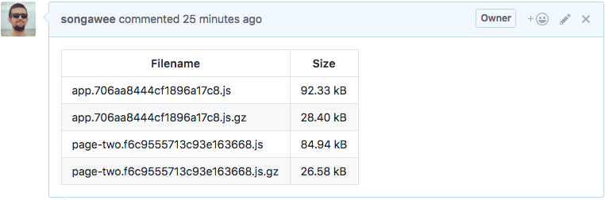

# Webtask Test

Webtask for updating GitHub Pull Requests with relevant filesizes generated from a client build system such as Webpack.

Results will look similar to:



## Input

This is the shape of the data required by the webtask as a POST request:

```ts
  {
    stats: [{ fileName: string, size: number }],
    meta: {
      username: string,
      repo: string,
      pr: string
    },
  }
```

NOTE: The pr will look like: `https://github.com/owner/repo/pull/1`

There is a script in the helpers directory that can be configured to be able to post to the webtask in the desired shape.

## Local Installation

Copy `.env.example` to `.env` and fill in the personal GitHub access token.

You will need to login to webtask: https://webtask.io/cli. The CLI is installed in this project and can be invoked by running:

```bash
yarn wc
```

### Install

```bash
yarn install
```

## Tests

```bash
yarn test
yarn test:watch
```

## Deployment

```bash
yarn deploy
```
